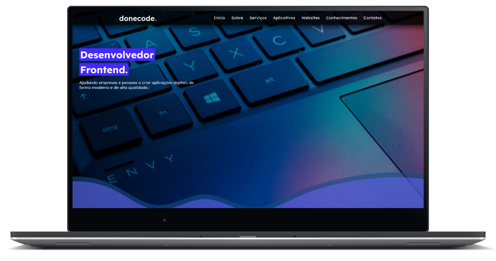
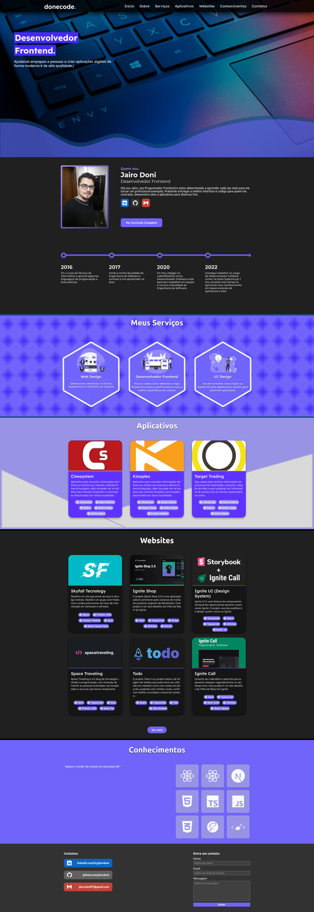

<h1 align="center">
    
</h1>

<div align="center">
  
  
  
  
<br>

<p align="center">
  <strong>
      <a href="#-Preview">Preview</a> &nbsp;|&nbsp; 
  </strong>
  <strong>
      <a href="#-projeto">Projeto</a> &nbsp;|&nbsp; 
  </strong>
  <strong>
      <a href="#-layout">Layout</a> &nbsp;|&nbsp; 
  </strong>
  <strong>
      <a href="#-tecnologias">Tecnologias</a> &nbsp;|&nbsp; 
  </strong>
  <strong>
      <a href="#-como-executar-o-projeto">Executando</a> &nbsp;|&nbsp; 
  </strong>
  <strong>
      <a href="#-referências">Referências</a> &nbsp;|&nbsp; 
  </strong>
  <strong>
      <a href="#-autor">Autor</a> 
  </strong>
</p>

<p align="center">
  
</p>
</div>

## **✨ Preview**

#### Website: https://www.donecode.com.br

<br/>


## **💻 Projeto**
Donecode é um site portfólio feito para divulgar meus trabalhos, projetos e mostrar o que eu posso oferecer como serviço para quem me contratar.


<br/>

## **🔖 Layout**

Você pode visualizar o layout do projeto no formato através [desse link](https://www.figma.com/file/thTK2wiUOn3e3MwpKvGcus/Donicode?type=design&node-id=1303%3A2&mode=design&t=3DpBuBy8HkHOuGHV-1). Lembrando que você irá precisar ter uma conta no [Figma](http://figma.com/).


#### **Web**
<p align="center">
  
</p>


<br/>

## **💻 Tecnologias**


 #### **Website**

  - **[Next][next]**
  - **[Typescript][typescript]**
  - **[Prismic][prismic]**
  - **[Radix UI][radix_ui]**
  - **[Framer Motion][framer_motion]**
  - **[Email JS][emailjs]**
  - **[Prettier][prettier]**
  - **[ESLint][eslint]**
  - **[Node v18.17.0][node]**
  - **[pnpm][pnpm]**

> \* Veja o arquivo <kbd>[package.json](./package.json)</kbd>

 #### **Utilitários**
 
 - Editor: **[Visual Studio Code][vscode]** 
 - Markdown: **[StackEdit][stackedit]**, **<kbd>[Markdown Emoji][markdown_emoji]</kbd>**

<br/>

##  **🚀 Como executar o projeto**

### Configurações Iniciais

Primeiro, você precisa ter o <kbd>[NodeJS](https://nodejs.org/en/download/)</kbd> instalado na sua máquina. 

Se você estiver utilizando o **Linux**, você pode optar por instalar o **Node** através do gerênciador de versões <kbd>[nvm]</kbd> para caso seja nescessario alterar a sua versão do **Node** para uma versão mais antiga ou mais nova.

Você pode optar também por utilizar o **pnpm** no lugar do **npm**. Você pode instalar clicando nesse <kbd>[link][pnpm]</kbd>.

Após ter o **Node** instalado, instale as dependências do **Next** contidas nos arquivos `package.json` que se encontram na raíz do repositório. Para instalar as dependências, basta abrir o terminal no diretório e digitar o comando:

```sh
$ npm i

# ou

$ pnpm i
```

> Veja a parte de **scripts {}** do arquivo <kbd>[package.json](./package.json)</kbd> para saber quais scripts estão disponíveis.


### Executando o WebSite

```sh
# Executando o website no modo de desenvolvimento:
$ npm run dev

# ou

# Executando o website no modo de desenvolvimento:
$ pnpm dev
```
> Se o browser não abrir automaticamente, acesse:  http://localhost:3000.

<br/>

## **📚 Referências**

- [Blog Rocketseat](https://blog.rocketseat.com.br/)
- [Next][next]
- [ReactJS](https://reactjs.org/docs/getting-started.html) | [ReactJS pt-BR](https://pt-br.reactjs.org/docs/getting-started.html)
- [Node](https://nodejs.org/en/)

<br/>

## **👨‍🚀 Autor**

<a href="https://github.com/jairodoni">
 
 <br />
 <sub><b>Jairo Doni Prudente Junior</b></sub></a>
 <br />

👋 Entre em contato!

[](https://www.linkedin.com/in/jairodoni/)
[](mailto:jairo.doni97@gmail.com)


<!-- Website Links -->

[rocketseat_site]: https://rocketseat.com.br/

<!-- Badges -->

[repository_license_badge]: https://img.shields.io/github/license/JairoDoni/NLW-1.0

[web_react_badge]: https://img.shields.io/badge/web-react-blue

[typescript]: https://img.shields.io/badge/types-Typescript-blue

<!-- Techs -->

[react]: https://reactjs.org/

[next]: https://nextjs.org/

[prismic]: https://prismic.io

[emailjs]: https://www.emailjs.com

[radix_ui]: https://www.radix-ui.com

[sass]: https://sass-lang.com

[framer_motion]: https://www.framer.com/motion/

[prettier]: https://prettier.io

[eslint]: https://eslint.org

[node]: https://nodejs.org/en/

[vscode]: https://code.visualstudio.com/

[stackedit]: https://stackedit.io

[markdown_emoji]: https://gist.github.com/rxaviers/7360908

[react_icons]: https://react-icons.github.io/react-icons/

[typescript]: https://www.typescriptlang.org/

[asdf]: https://github.com/asdf-vm/asdf

[pnpm]: https://pnpm.io

[webpack]: https://webpack.js.org
